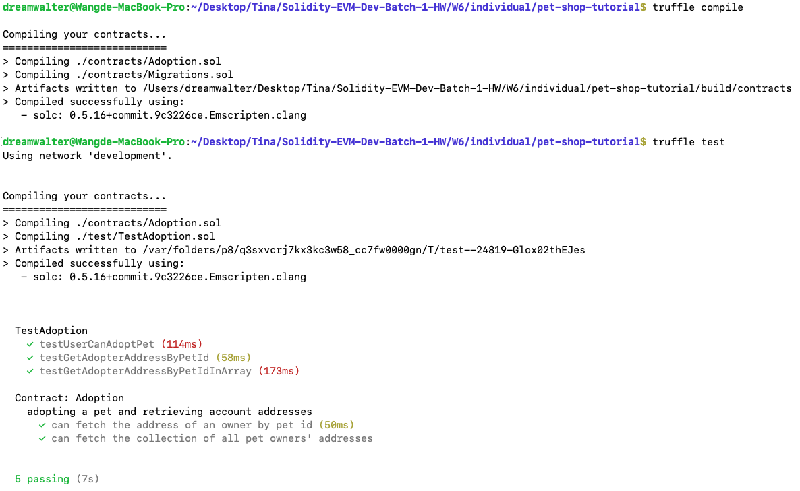
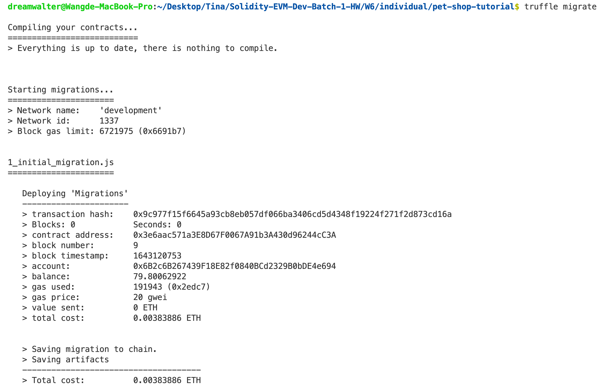
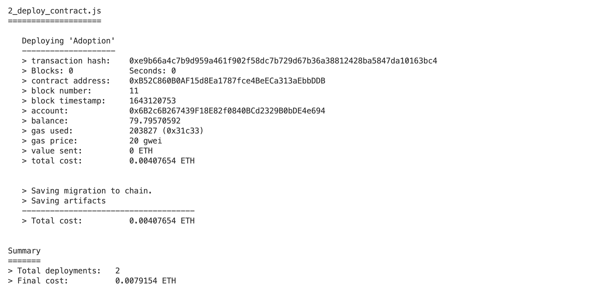

## 1. Follow 此教學並寫下做法與提供完成截圖
```
  1. pet-shop-tutorial: truffle parts
  - truffle unbox pet-shop
  - truffle compile
  - truffle migrate
  - truffle test
```
- truffle compile and test 
- truffle migrate 
  

```
  2. pet-shop-tutorial: web3 parts
  - Coming soon
```


## 2. Follow 此影片與 Github 並寫下做法與提供完成截圖
      - 如何使用 web3.js 跟區塊鏈智能合約互動與進行資安審計 / JSDC 2021
